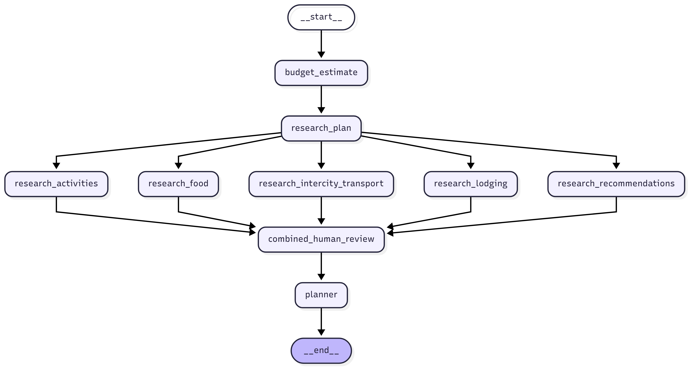
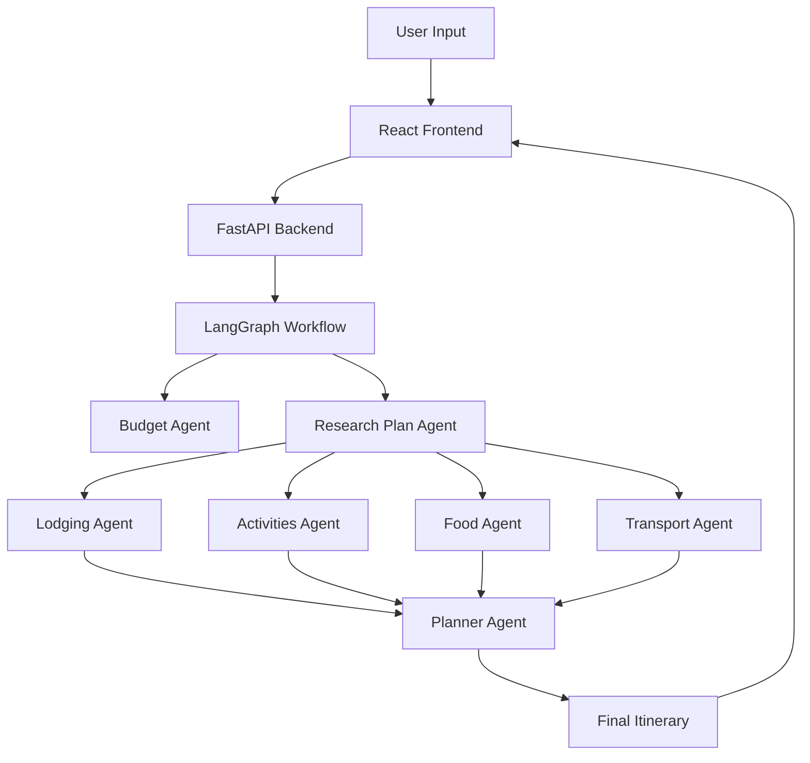

# Trip Planner - AI-Powered Travel Planning Platform

Trip Planner is an agentic travel planning platform built around a LangGraph workflow extracted from [trip planner notebook](trip_planner.ipynb). The system coordinates multiple research agents (lodging, activities, food, transport, and advisory) to assemble a day-by-day itinerary, supports human-in-the-loop decisions, and exposes the workflow through a FastAPI service.

# Workflow's diagram 




## 🌟 Features

- **AI-Powered Planning**: Uses LangGraph to coordinate multiple specialized agents for comprehensive trip planning
- **Interactive Web Interface**: Modern React frontend with responsive design and real-time updates
- **Human-in-the-Loop**: Allows users to make decisions during the planning process
- **Multi-Agent Architecture**: Specialized agents for lodging, activities, food, transport, and recommendations
- **Retrieval-Augmented Research**: RAG pipeline with internet search, Reddit integration, and vector store search
- **Budget Estimation**: Intelligent budget breakdown across all travel categories
- **Real-time Results**: Live updates as the planning process progresses

## 🏗️ Architecture

The application consists of three main components:

1. **Jupyter Notebook** (`trip_planner.ipynb`) - Core workflow implementation and development environment
2. **Backend API** (Python/FastAPI) - Production API server with LangGraph integration
3. **Frontend** (React/TypeScript) - User interface for trip planning and results

### System Flow



## 🚀 Quick Start

### Prerequisites

- **Python 3.12+**
- **Node.js 16+**
- **npm or yarn**
- **API Keys** for external services (see Environment Setup)

### Environment Setup

1. **Clone the repository**:
   ```bash
   git clone <repository-url>
   cd trip_planner
   ```

2. **Create environment file**:
   ```bash
   cp .env.example .env
   ```

3. **Configure API keys** in `.env`:
   ```env
   # Required for core functionality
   OPENAI_API_KEY=your_openai_key
   TAVILY_API_KEY=your_tavily_key
   
   # Optional but recommended
   REDDIT_CLIENT_ID=your_reddit_client_id
   REDDIT_CLIENT_SECRET=your_reddit_client_secret
   TRIP_ADVISOR_API=your_tripadvisor_key
   AMADEUS_API=your_amadeus_key
   AMADEUS_SECRET=your_amadeus_secret
   XAI_API_KEY=your_xai_key
   
   # Optional for tracing
   LANGCHAIN_API_KEY=your_langsmith_key
   ```

### Installation & Setup

#### Backend Setup

1. **Create virtual environment**:
   ```bash
   python -m venv .venv
   source .venv/bin/activate  # On Windows: .venv\Scripts\activate
   ```

2. **Install dependencies**:
   ```bash
   pip install -r requirements.txt
   ```

3. **Start the backend**:
   ```bash
   uvicorn src.api.app:app --reload --host 0.0.0.0 --port 8000
   ```

#### Frontend Setup

1. **Navigate to frontend directory**:
   ```bash
   cd frontend
   ```

2. **Install dependencies**:
   ```bash
   npm install
   ```

3. **Start the frontend**:
   ```bash
   npm start
   ```

4. **Access the application**:
   - Frontend: http://localhost:3000
   - Backend API: http://localhost:8000
   - API Documentation: http://localhost:8000/docs

## 📖 Usage

### Web Interface

1. **Open the application** at http://localhost:3000
2. **Fill out the trip form** with:
   - Destination and dates
   - Budget and currency
   - Traveler information
   - Trip preferences
3. **Submit to start planning** - the AI agents will begin research
4. **Make selections** when prompted for human input
5. **Review final itinerary** with day-by-day breakdown

### API Usage

#### Start Planning
```bash
curl -X POST "http://localhost:8000/plan/start" \
  -H "Content-Type: application/json" \
  -d '{
    "context": {
      "destination": "Paris, France",
      "date_from": "2024-06-01",
      "date_to": "2024-06-05",
      "budget": 2000,
      "currency": "USD",
      "group_type": "couple",
      "travellers": [
        {
          "name": "John Doe",
          "date_of_birth": "1990-01-01"
        }
      ]
    }
  }'
```

#### Resume Planning
```bash
curl -X POST "http://localhost:8000/plan/resume/{thread_id}" \
  -H "Content-Type: application/json" \
  -d '{
    "selections": {
      "lodging": 0,
      "activities": [0, 1, 2],
      "food": [0, 1],
      "transport": 0
    }
  }'
```

## 🧪 Development

### Project Structure

```
trip_planner/
├── trip_planner.ipynb          # Core workflow implementation
├── src/                        # Backend Python modules
│   ├── api/                    # FastAPI application
│   ├── core/                   # Domain models and configuration
│   ├── pipelines/              # RAG pipeline implementation
│   ├── services/               # External API integrations
│   ├── tools/                  # Search and research tools
│   └── workflows/              # LangGraph nodes and compilation
├── frontend/                   # React frontend application
│   ├── src/
│   │   ├── components/         # React components
│   │   ├── hooks/              # Custom React hooks
│   │   ├── services/           # API services
│   │   └── types/              # TypeScript definitions
│   └── package.json
├── tests/                      # Test suite
├── docs/                       # Documentation
└── docker-compose.yml          # Container orchestration
```

### Development Workflow

1. **Start with the notebook**: Implement new features in `trip_planner.ipynb` first
2. **Test thoroughly**: Ensure all cells execute without errors:
   ```bash
   jupyter nbconvert --execute --to notebook --inplace trip_planner.ipynb
   ```
3. **Extract to modules**: Move stable logic to appropriate `src/` modules
4. **Update tests**: Add tests for new functionality
5. **Sync implementations**: Ensure notebook and Python code remain synchronized

### Running Tests

```bash
# Backend tests
pytest tests/ -v

# Frontend tests
cd frontend && npm test

# Notebook validation
pytest --nbmake trip_planner.ipynb
```

### Code Quality

- Follow PEP 8 conventions for Python code
- Use TypeScript strict mode for frontend code
- Maintain comprehensive test coverage
- Keep notebook and Python implementations synchronized

## 🐳 Docker Deployment

### Development with Docker

```bash
# Build and start all services
docker-compose up --build

# Run tests in container
docker-compose run tests
```

### Production Deployment

```bash
# Build production images
docker build -t trip-planner-app .

# Run with environment variables
docker run -p 8000:8000 --env-file .env trip-planner-app
```

## 🔧 Configuration

### Environment Variables

| Variable | Required | Description |
|----------|----------|-------------|
| `OPENAI_API_KEY` | Yes | OpenAI API key for LLM functionality |
| `TAVILY_API_KEY` | Yes | Tavily API key for internet search |
| `REDDIT_CLIENT_ID` | No | Reddit API client ID |
| `REDDIT_CLIENT_SECRET` | No | Reddit API client secret |
| `TRIP_ADVISOR_API` | No | TripAdvisor API key |
| `AMADEUS_API` | No | Amadeus API key for flights |
| `AMADEUS_SECRET` | No | Amadeus API secret |
| `XAI_API_KEY` | No | xAI API key for Grok models |
| `LANGCHAIN_API_KEY` | No | LangSmith API key for tracing |

### API Configuration

The API can be configured through environment variables or the `ApiSettings` class in `src/core/config.py`. Key settings include:

- Model selection and parameters
- Rate limiting and timeouts
- Logging and tracing configuration
- External service endpoints

## 📊 Monitoring & Observability

### LangSmith Tracing

Enable tracing by setting `LANGCHAIN_API_KEY` in your environment. This provides:

- Complete workflow execution traces
- Agent performance metrics
- Token usage tracking
- Error analysis and debugging

### Logging

The application uses structured logging throughout:

- API request/response logging
- Agent execution logs
- Error tracking and debugging
- Performance metrics

## 🤝 Contributing

1. **Fork the repository**
2. **Create a feature branch**: `git checkout -b feature/amazing-feature`
3. **Make your changes**:
   - Start with notebook implementation
   - Extract to Python modules
   - Add comprehensive tests
   - Update documentation
4. **Test thoroughly**:
   ```bash
   pytest tests/ -v
   jupyter nbconvert --execute --to notebook --inplace trip_planner.ipynb
   ```
5. **Commit your changes**: `git commit -m 'Add amazing feature'`
6. **Push to the branch**: `git push origin feature/amazing-feature`
7. **Open a Pull Request**

### Development Guidelines

- **Notebook First**: Always implement new features in the notebook first
- **Test Coverage**: Maintain comprehensive test coverage
- **Documentation**: Update relevant documentation
- **Code Review**: Ensure Python implementation matches notebook logic
- **Synchronization**: Keep notebook and Python code in sync

## 📝 License

This project is licensed under the MIT License - see the [LICENSE](LICENSE) file for details.

## 🆘 Support

- **Documentation**: Check the `docs/` directory for detailed guides
- **Issues**: Report bugs and feature requests via GitHub issues
- **Discussions**: Join community discussions for questions and ideas

## 🔮 Roadmap

- [ ] Enhanced mobile experience
- [ ] Real-time collaboration features
- [ ] Advanced budget optimization
- [ ] Integration with more travel services
- [ ] Multi-language support
- [ ] Offline functionality
- [ ] Advanced analytics and insights

---

**Built with ❤️ using LangGraph, FastAPI, and React**